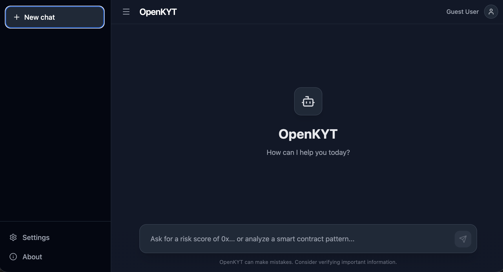

# OpenKYT

OpenKYT is an open-source, privacy-preserving, and transparent AI-powered blockchain analytics platform for anti-money laundering (AML) and counter-terrorist financing (CTF). It combines the power of Large Language Models (LLMs) with advanced blockchain analytics to provide deep insights into transaction patterns, risk scoring, and compliance reporting.



## Features

- **AI-Powered Analysis**: Uses LLMs to understand complex queries and provide natural language explanations.
- **Privacy-Preserving**: All analysis is done locally or through secure, private endpoints. No user data is stored without explicit consent.
- **Transparent**: All decisions and risk scores are explainable through the LLM's reasoning process.
- **Real-time Streaming**: Get insights as the analysis happens with real-time streaming of results.
- **Multi-Methodological Approach**: Combines rule-based systems, machine learning, and graph analytics for comprehensive risk assessment.

## Getting Started

### Prerequisites

- Python 3.8+
- Node.js 16+
- Docker (for running the backend)

### Installation

1. **Clone the repository**
   ```bash
   git clone <repository-url>
   cd mvp
   ```

2. **Backend Setup**
   ```bash
   cd backend
   pip install -r requirements.txt
   
   ```

3. **Frontend Setup**
   ```bash
   cd frontend
   npm install
   npm run dev
   ```

## Usage

1. Open the frontend in your browser (usually `http://localhost:3000`).
2. Start typing your queries in the chat interface.
3. The AI will analyze the transaction patterns and provide insights.

## Roadmap

See [roadmap.md](roadmap.md) for the development roadmap.

## License

This project is licensed under the Apache-2.0 License - see the [LICENSE](LICENSE) file for details.